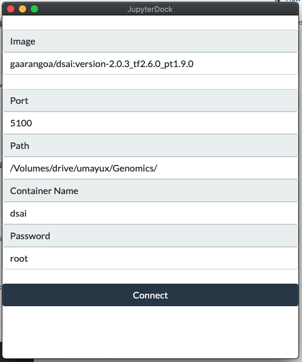

## JupyterDock

We love jupyter lab, and the desktop version is amazing. However, we normally customize our libraries using docker images. So, We have created JupyterDock, an Electron APP for launching Jupyter lab instances as a desktop app running under docker containers giving you a lot of freedom!

All you need to have is a docker image with your dependencies installed (don't forget Jupyter Lab). Then, just use the GUI to generate a Jupyter Lab APP.

For the moment we have JupyterDock only available for MAC OS

# Requirements
* Make sure to have installed docker in your computer.
* Make sure to have installed jupyter lab in your docker image. 

