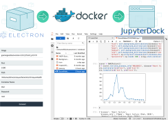

## JupyterDock

We love jupyter lab, and the desktop version is amazing. However, we normally customize our libraries using docker images. So, We have created <a href="https://github.com/umayuxlabs/JupyterDock/raw/master/desktop_apps/JupyterDock.dmg"> JupyterDock </a> , an Electron APP for launching Jupyter lab instances as a desktop app running under docker containers giving you a lot of freedom!

All you need to have is a docker image with your dependencies installed (don't forget Jupyter Lab). Then, just use the GUI to generate a Jupyter Lab APP.

For the moment we have JupyterDock only available for MAC OS

<iframe width="100%" height="315" src="https://www.youtube.com/watch?v=gWu2nAft2AM&ab_channel=UmayuxLabs" frameborder="0" allow="autoplay; encrypted-media" allowfullscreen></iframe>

### Requirements

1. Make sure to have installed docker in your computer.
2. Make sure to have installed jupyter lab in your docker image. 
3. Download <a href="https://github.com/umayuxlabs/JupyterDock/raw/master/desktop_apps/JupyterDock.dmg"> JupyterDock app </a> 
  * If the app does not work. Follow the instructions in the main <a href="https://github.com/umayuxlabs/JupyterDock/tree/master">repository</a> to build the app with electron. 

### Launch JupyterDock
1. Before you start a jupyter instance, you need to select the image from docker hub with your customized environment (By default an image with several data science tools and jupyter lab installed is available).
2. You need to setup the directory where jupyter lab will be run (the root directory). 
3. Set the docker container name and the exposed port (if you are running multiple containers you need to setup a different port)
4. Define a password for your jupyter lab instance. 

### Keep in mind
1. The first time it will take a while to launch your instance as docker has to download the image from docker hub. 
2. Running the container may take a couple of minutes. Just wait a little bit!

